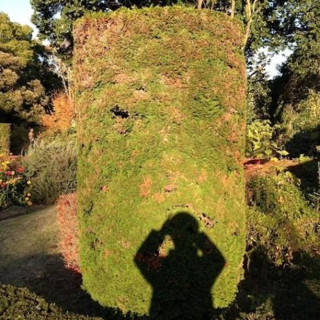
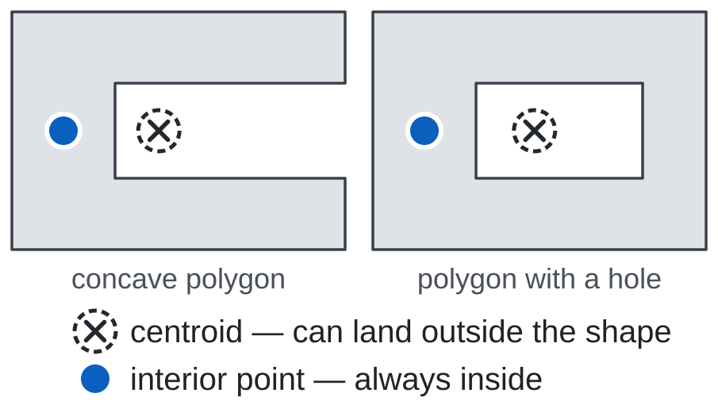
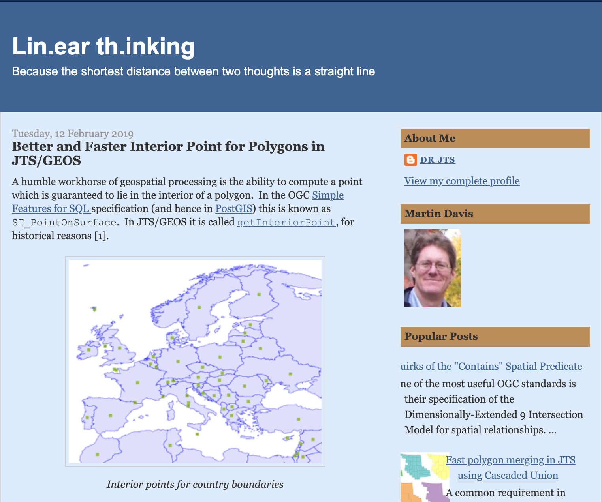
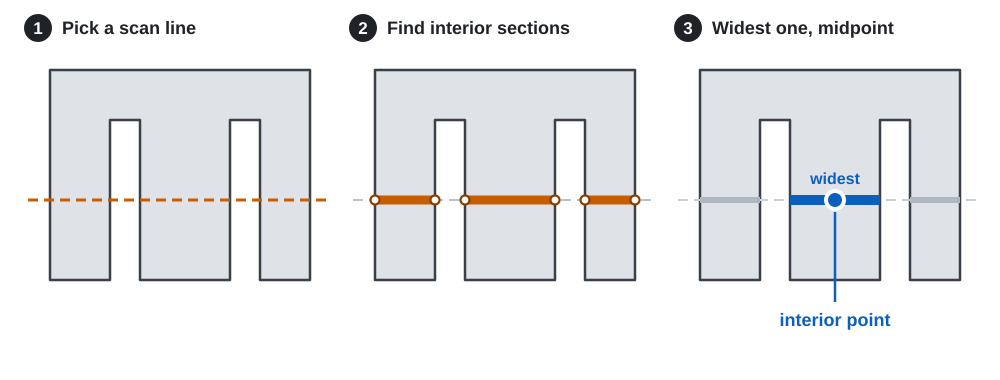
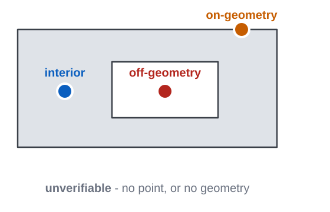
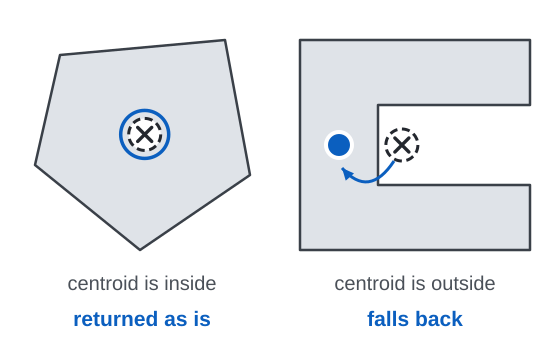
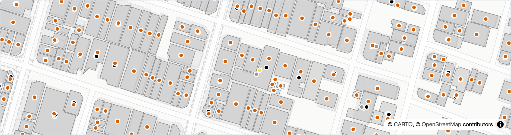
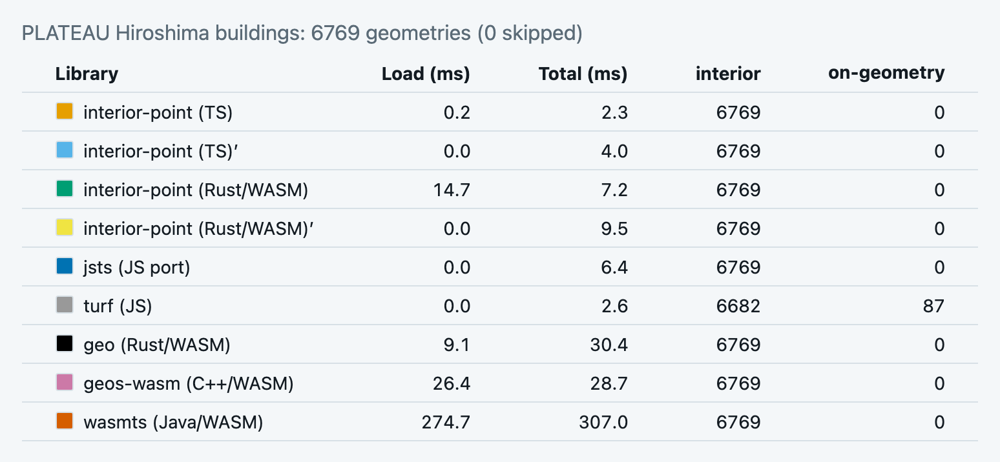

<!-- _class: lead -->

# Porting JTS Interior Point Algorithm to TypeScript and Rust/WASM

FOSS4G Hiroshima 2026, Japan - Lightning Talk

Ko Nagase

<!--
(~15s) Good afternoon. I'm Ko Nagase, and today I'd like to talk about Porting the JTS Interior Point Algorithm to TypeScript and Rust/WASM.
-->

---

<!-- _class: intro -->



# Who am I?

## Ko Nagase @ Geolonia Inc.

- Geospatial developer - geocoder, maps, vector tiles and **geometry**
- **sanak** on [](https://github.com/sanak) [](https://wiki.osgeo.org/wiki/User:Sanak), or **geosanak** on [](https://bsky.app/profile/geosanak.bsky.social) [](https://x.com/geosanak)

<!--
(~11s) I'm a geospatial developer at Geolonia in Japan, and I use sanak or geosanak as account names.
-->

---



# Why an interior point?

- A centroid can miss the shape
  - Concave shapes, holes, multi-part: the centroid lands outside
- The interior point is guaranteed to lie inside

<!--
(~28s) In Japan, open data often adds a representative point for each polygon, probably to reduce the geometry size, but the question is where to put it. A centroid is an average, so it can miss the shape, but the interior point, in blue, is guaranteed to be inside.
-->

---

# For browser use, the choices are limited

| Library                                                                      | How it ships             | Browser        | License          | JTS interior point?        |
| ---------------------------------------------------------------------------- | ------------------------ | -------------- | ---------------- | -------------------------- |
| [**jsts**](https://github.com/bjornharrtell/jsts) `getInteriorPoint`         | npm, JS port of JTS      | 340 KB JS      | EPL / EDL        | ✓ JTS 1.17-era port        |
| [**turf**](https://github.com/Turfjs/turf) `pointOnFeature`                  | npm, plain JS            | 11 KB JS       | MIT              | ✗ bbox center, else vertex |
| [**geo**](https://github.com/georust/geo) `interior_point`                   | Rust crate               | build yourself | MIT / Apache-2.0 | △ different algorithm      |
| [**geos-wasm**](https://github.com/chrispahm/geos-wasm) `GEOSPointOnSurface` | npm, GEOS via Emscripten | 2.6 MB wasm    | LGPL             | ✓ via the GEOS C++ port    |
| [**wasmts**](https://github.com/willcohen/wasmts) `InteriorPoint`            | npm, JTS via GraalVM     | 14 MB wasm     | EPL / EDL        | ✓ JTS 1.20, still alpha    |

<!--
(~39s) For native use, JTS itself or GEOS bindings are available, but for browser use, the choices are limited.
Compiling JTS or GEOS to WASM makes them heavy to download.
Porting it all makes it hard to maintain.
turf takes a bounding-box center, or a vertex on the boundary,
and the Rust geo crate uses a different algorithm.
-->

---

<!-- _class: cited -->

# Just port the algorithm!

- In 2016, JTS became EPL or **EDL**, a BSD-style license compatible with MIT
- Martin Davis ([@dr-jts](https://github.com/dr-jts)) improved interior point in 2019, which made it far easier to port
- And the LLM coding agent era started in 2026


_[Lin.ear th.inking: Better and Faster Interior Point for Polygons in JTS/GEOS](https://lin-ear-th-inking.blogspot.com/2019/02/better-and-faster-interior-point-for.html)_

<!--
(~28s) So, I decided to just port the algorithm! Luckily, there are three good things. The license became MIT-compatible in 2016. JTS's author, Martin Davis, improved the algorithm in 2019. And LLM coding agents arrived this year.
-->

---

<!-- _footer: "Quoted from JTS's [`InteriorPointArea`](https://locationtech.github.io/jts/javadoc/org/locationtech/jts/algorithm/InteriorPointArea.html) Javadoc" -->

# The algorithm, in three steps

1. Determine a horizontal scan line on which the interior point will be located
2. Compute the sections of the scan line which lie in the interior of the polygon
3. Choose the widest interior section and take its midpoint as the interior point



<!--
(~19s) The algorithm is three steps. Pick a horizontal line, keep the parts inside the polygon, take the midpoint of the widest one. The line is near the middle of the polygon, but never through a vertex.
-->

---

<!-- _class: compare -->

# Keeping a port honest

### Java `(upstream/jts/main/algorithm/InteriorPointArea.java)`

```java
private void findBestMidpoint(List<Double> crossings) {
  // ...
  crossings.sort(Double::compare);
  for (int i = 0; i < crossings.size(); i += 2) {
    double x1 = crossings.get(i);
    double x2 = crossings.get(i + 1);
    double width = x2 - x1;
    if ( width > interiorSectionWidth ) {
      interiorSectionWidth = width;
      double interiorPointX = avg(x1, x2);
      interiorPoint = new Coordinate(interiorPointX, interiorPointY);
    }
  }
}
```

### TypeScript `(js/src/algorithm/InteriorPointArea.ts)`

```typescript
private findBestMidpoint(crossings: number[]): void {
  // ...
  crossings.sort((a, b) => a - b);
  for (let i = 0; i < crossings.length; i += 2) {
    const x1 = crossings[i];
    const x2 = crossings[i + 1];
    const width = x2 - x1;
    if (width > this.interiorSectionWidth) {
      this.interiorSectionWidth = width;
      const interiorPointX = avg(x1, x2);
      this.interiorPoint = [interiorPointX, this.interiorPointY];
    }
  }
}
```

### Rust `(rs/core/src/algorithm/interior_point_area.rs)`

```rust
fn find_best_midpoint(&mut self, crossings: &mut [f64]) {
    // ...
    crossings.sort_by(|a, b| a.partial_cmp(b).unwrap());
    for pair in crossings.chunks_exact(2) {
        let x1 = pair[0];
        let x2 = pair[1];
        let width = x2 - x1;
        if width > self.interior_section_width {
            self.interior_section_width = width;
            let interior_point_x = avg(x1, x2);
            self.interior_point = Some(Coord {
                x: interior_point_x,
                y: self.interior_point_y,
            });
        }
    }
}
```

<!--
(~17s) When porting, I keep the TypeScript and Rust code as close to the original Java code as possible. JTS's own tests are ported as well, and run against both.
-->

---

# Command Line Interface (CLI)

### JTS ships its own command

<pre is="marp-pre" data-auto-scaling="downscale-only"><code class="language-sh"><span class="cmd">jtsop</span> -a buildings.geojson -eacha -f geojson -o out.geojson \
    Construction.interiorPoint
</code></pre>

### This port ships one too, from npm or from crates.io

<pre is="marp-pre" data-auto-scaling="downscale-only"><code class="language-sh">npm install -g interior-point
<span class="hljs-comment"># cargo install interior-point --features cli</span>

<span class="cmd">interior-point</span> -i buildings.geojson -o out.geojson
</code></pre>

<!--
(~13s) As for the CLI, JTS ships jtsop. This port ships interior-point, and it does the same job in a shorter form.
-->

---

<!-- _class: pair -->

# Additional functions

### `verifyInteriorPoint`

Reports where a point sits relative to the geometry it came from - four values rather than a boolean.



### `centroidFirstInteriorPoint`

Returns the centroid when it lies strictly inside, and falls back to the algorithm when it does not.



<!--
(~20s) I added two functions that are not in JTS. Verify says whether a point is interior, on-geometry, or off-geometry. Centroid-first returns the centroid, or falls back.
-->

---

<!-- _class: cited wide -->

# Benchmarks

- PLATEAU Hiroshima 2024 - 6769 building footprints, measurable in your browser
- interior-point TS ×2, Rust/WASM ×2, jsts, turf, geo, geos-wasm, wasmts
- Every result verified with `verifyInteriorPoint`



_[sanak.github.io/interior-point/examples/benchmark/](https://sanak.github.io/interior-point/examples/benchmark/)_


<!--
(~19s) There is a benchmark site with PLATEAU Hiroshima building footprints, and you can run it in your browser.
The TypeScript port is fast enough, and the WebAssembly rows pay a load cost first.
(Eight of the nine return all interior points. turf misses 87, putting its points on the geometry rather than in it.)
-->

---

<!-- _class: final -->

# Try it!

- Website: [sanak.github.io/interior-point](https://sanak.github.io/interior-point/)
- GitHub: [github.com/sanak/interior-point](https://github.com/sanak/interior-point)

```sh
npm install interior-point
cargo add interior-point
```


<video src="img/interior-point-foss4g-hiroshima.mov" autoplay loop muted playsinline controls></video>

<!--
(~20s) The website has the docs and the benchmarks, so you can try it!
The front page map has a text input and you can type English or Japanese and see the results as orange points.
Thank you!
-->
